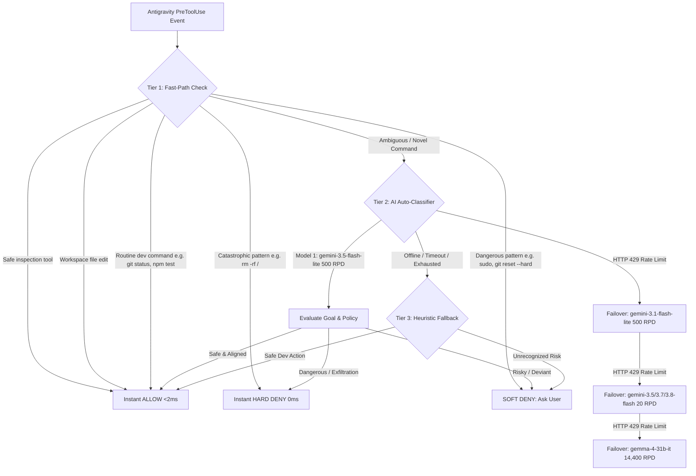

# agy-auto-mode 🛡️

[](LICENSE)
[](https://www.python.org/)
[](https://github.com/google-deepmind)
[](https://aistudio.google.com/)

An autonomous, Claude Code-style **Auto-Mode Security Classifier** for [Google Antigravity](https://github.com/google-deepmind) (`agy` CLI and Antigravity IDE).

Stop dealing with repetitive, disruptive confirmation prompts for routine commands (`git status`, `npm test`, workspace file edits) while ensuring your system is strictly protected against catastrophic actions, accidental data loss, and credential leaks.

---

## Key Features

- **⚡ Fast-Path Execution (<2ms):** Routine commands, inspections, builds, tests, and workspace file modifications execute instantly without calling any external API.
- **🧠 3-Tier Multi-Model Security Engine:** Ambiguous or novel commands are analyzed by Google AI Studio models against your stated goal and safety policy.
- **🔄 Autonomous Cascading Failover:** If a model encounters a rate limit (`HTTP 429`), it dynamically fails over to the next best model in your pool without interrupting execution.
- **💰 100% Free Tier Supported:** Runs entirely on Google AI Studio's free tier with generous limits (500 to 14,400+ requests/day). No credit card required.
- **📦 Native Antigravity Plugin:** Installs cleanly as an AGY plugin with lifecycle hook (`PreToolUse`), custom skill (`SKILL.md`), and behavioral rules (`AGENTS.md`).
- **🛡️ Custom Security Boundaries:** Easily tweak allowed commands, confirmation triggers (soft deny), and absolute blocks (hard deny) via standard JSON.

---

## Architecture



### Cascading Model Pool (Free Tier Quota)

| Priority | Model | Free Tier Quota | Purpose |
| :--- | :--- | :--- | :--- |
| **1 (Primary)** | `gemini-3.5-flash-lite` | 500 requests/day (15 RPM) | Ultra-fast, intelligent classification workhorse |
| **2 (Secondary)** | `gemini-3.1-flash-lite` | 500 requests/day (15 RPM) | Instant secondary failover |
| **3 (Frontier)** | `gemini-3.5-flash` / `3.7-flash` / `3.8-flash` | 20 requests/day each | Frontier reasoning fallback reserve |
| **4 (Open Pool)** | `gemma-4-31b-it` / `gemma-4-26b-a4b-it` | 14,400 requests/day each | High-capacity open model reserve |

---

## Quickstart

### 1. Installation

Clone this repository directly into your global Antigravity plugins directory:

```bash
git clone https://github.com/marmarmamark/agy-auto-mode.git ~/.gemini/config/plugins/agy-auto-mode
```

Or run the included installer:

```bash
git clone https://github.com/marmarmamark/agy-auto-mode.git
cd agy-auto-mode
bash install.sh --global
```

*(To install only for a single project, run `bash install.sh --workspace` inside your project root).*

### 2. Configure Your Free API Key

The installer automatically checks for existing keys in your environment and prompts you:
```text
 Detected existing Gemini API key: AIzaSy...xxxx
 Use detected key? [Y/n]: 
```
- If you answer `n`, you can enter a new key which is safely saved to `~/.env`.
- If no key is detected, you can paste one or press Enter to run in local heuristic-only mode.

You can also manually export it in your shell (`~/.zshrc` or `~/.bashrc`):

```bash
export GEMINI_API_KEY="your_api_key_here"
```

Or place it in your `~/.env` file:

```dotenv
GEMINI_API_KEY=your_api_key_here
```

Get a free Google AI Studio key at [aistudio.google.com](https://aistudio.google.com/) (free tier, no credit card required).

### 3. Verify Installation

Run the automated test suite to ensure the hook and safety checks are functioning:

```bash
python3 ~/.gemini/config/plugins/agy-auto-mode/tests/test_classifier.py
```

You should see:
```text
Ran 8 tests in 0.003s

OK
```

---

## Customizing Security Policies

The policy rules are defined in `auto_mode_rules.json`. You can customize them globally at `~/.gemini/config/plugins/agy-auto-mode/auto_mode_rules.json` or per project at `.agents/auto_mode_rules.json`.

```json
{
  "environment": [
    "Primary use: software development in macOS/Linux",
    "Sensitive paths: ~/.ssh, ~/.aws, ~/.gnupg, /etc, /System"
  ],
  "allow": [
    "Inspection and read-only actions: viewing files, listing directories, search, documentation",
    "Code modifications to files located strictly within trusted workspaces",
    "Standard developer, build, test, and package management commands: npm, pnpm, yarn, bun, pip, python, pytest, cargo, go",
    "Routine git queries and local operations: git status, diff, log, branch, add, commit, checkout"
  ],
  "soft_deny": [
    "File deletions or recursive removals (rm, rm -rf, shred)",
    "Privileged system commands or privilege escalation (sudo, su)",
    "Destructive git operations that discard history: git push --force, git reset --hard, git clean -f",
    "Piping untrusted remote scripts directly to shell (curl | sh, wget | bash)"
  ],
  "hard_deny": [
    "Data exfiltration of credentials, private keys, or API tokens",
    "Catastrophic system destruction: wiping root filesystem, formatting disk partitions"
  ]
}
```

---

## Statusline Integration

If you use a custom statusline for `agy`, you can track your remaining daily classifier requests by reading `~/.gemini/config/classifier_usage.json`:

```python
import json, os, time

def get_classifier_remaining():
    path = os.path.expanduser("~/.gemini/config/classifier_usage.json")
    if os.path.exists(path):
        try:
            with open(path) as f:
                data = json.load(f)
                cutoff = time.time() - 86400
                timestamps = [t for t in data.get("timestamps", []) if t > cutoff]
                return max(0, data.get("daily_limit", 15000) - len(timestamps))
        except Exception:
            pass
    return 15000
```

---

## Contributing & Development

Contributions are welcome! If you find edge cases or new safe command patterns:

1. Fork this repository.
2. Add new test cases in `tests/test_classifier.py`.
3. Submit a Pull Request.

---

## License

MIT License. See [LICENSE](LICENSE) for details.
