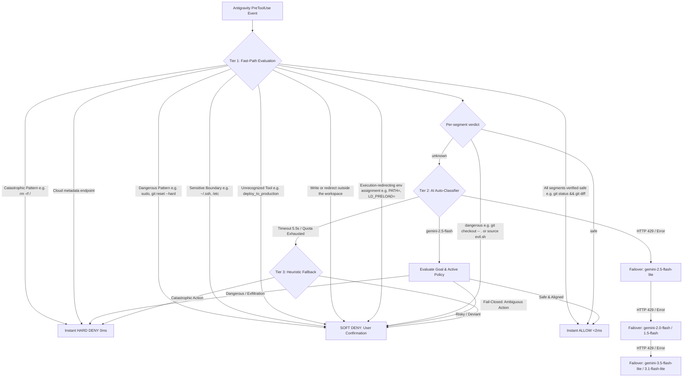

# agy-auto-mode 🛡️

[](https://github.com/marmarmamark/agy-auto-mode/actions/workflows/test.yml)
[](LICENSE)
[](https://www.python.org/)
[](https://github.com/google-deepmind)
[](https://aistudio.google.com/)

An autonomous, Claude Code-style **Auto-Mode Security Classifier** for [Google Antigravity](https://github.com/google-deepmind) (`agy` CLI and Antigravity IDE).

Stop dealing with repetitive, disruptive confirmation prompts for routine commands (`git status`, `git diff`, `git add`, `npm test`, workspace file edits) while ensuring your system is strictly protected against catastrophic actions, accidental data loss, and credential leaks.

---

## Requirements

| Dependency | Required? | Why | Get it |
| :--- | :--- | :--- | :--- |
| **Google Antigravity (`agy`)** | **Required** | This is an Antigravity plugin. Antigravity is what invokes the `PreToolUse` hook, so without it the plugin never runs. | [antigravity.google](https://antigravity.google/) |
| **Python 3.9+** | **Required** | The classifier is a single stdlib-only script with no third-party packages. | [python.org](https://www.python.org/) |
| **Google AI Studio API key** | Optional | Enables Tier 2 AI classification of ambiguous commands. Without a key the classifier runs Tier 1 + Tier 3 only and fails closed (prompts) on anything ambiguous — safe, just chattier. Free tier, no credit card. | [aistudio.google.com](https://aistudio.google.com/) |

`install.sh` checks for each of these and points you at the download rather than
installing a hook that silently never fires.

---

## Threat Model & Scope

`agy-auto-mode` is designed to **prevent an aligned AI coding agent from executing catastrophic or dangerous actions by accident or misunderstanding** (such as recursive directory wipes, privilege escalation, force-pushing over remote history, or transmitting private credentials).

> [!NOTE]
> Developer tooling commands like `npm run <script>`, `pytest`, `cargo test`, `go test`, and `make` execute developer-defined code by construction (via `package.json`, `conftest.py`, `build.rs`, or `Makefile`). Installing dependencies (`npm ci`, `npm install <pkg>`, `pip install`) runs that same code, which is why it shares their treatment. Auto-mode acts as an intelligent operational safety guardrail, not an operating system-level sandbox against a hostile repository or a compromised model.

---

## Key Features

- **⚡ Fast-Path Execution (<2ms):** Routine commands, inspections, builds, tests, and workspace file modifications execute instantly without calling any external API. The deterministic allow-list covers everyday development end to end — read-only utilities (`ls`, `cat`, `rg`, `jq`, `sed -n`, `find`, `awk`), read-only git plus `fetch`/`pull`/`merge`, build and test runners, dependency installs (`npm install <pkg>`, `pip install`, `cargo add`, `go get`), inline data one-liners (`python3 -c`, `node -e`), plain `curl` GETs, build-artifact cleanup (`rm -rf node_modules`, `dist`, `build`), `/tmp` scratch work, pipes, `2>&1` redirection, env-prefixed and `timeout`-wrapped commands, and workspace-relative writes (`mkdir`, `touch`, `cp`, `mv`, `sed -i`, `> file`).
- **🎯 Prompts Only Where It Matters:** Because Tier 1 recognizes the routine work, confirmation is reserved for what actually carries risk. Against an 81-command corpus of everyday development commands the fast path allows 100% with no AI call; against a 67-command corpus of destructive, exfiltrating and bypass-shaped commands (including alias-laundered inline code and `/tmp/../etc` traversal) it allows none.
- **🧠 Inline Code Judged By What It Does:** `python3 -c` and `node -e` are how an agent reads a JSON field or reformats a string, so they run on the fast path — unless the program text reaches the shell, the network, the environment, or the filesystem. Aliasing does not help: `import os as o; o.system(...)` is matched on the call shape, not the module name.
- **🧹 Scoped Destructive Exemptions:** `rm -rf` is routine for build output (`node_modules`, `dist`, `target`, `__pycache__`) inside the workspace and for genuine `/tmp` scratch. Every path is resolved before it is judged, so `rm -rf /tmp/../etc` is the deletion of `/etc` that it actually is, and `rm -rf ~/dist` is not the same command as `rm -rf ./dist`.
- **🔎 Substitution-Aware:** `$(...)`, backticks and `<(...)` no longer disqualify a command wholesale — the body is extracted and classified in its own right, so `cd $(git rev-parse --show-toplevel)` runs while `echo $(git checkout -- .)` still prompts.
- **🛡️ Compound Command Decomposition:** Chained commands (`;`, `&&`, `||`, `|`, `\n`) are split and analyzed so every single sub-command must be on the strict allow-list.
- **🔒 Fail-Closed By Default:** Missing schemas, unknown tools, and ambiguous offline commands default to user confirmation (`force_ask`), never silent execution.
- **⛔ Deterministic Findings Are Final:** A construct the local rules flag as dangerous always prompts. It is never handed to the AI tier, which cannot upgrade it to `allow`.
- **🌐 Metadata Blocking, Without Breaking Local Dev:** Cloud metadata endpoints (`169.254.169.254`, `169.254.170.2`, `metadata.google.internal`) are hard-denied. Loopback and RFC1918 are *not* blocked — reaching your own dev server is routine.
- **🔄 Autonomous Cascading Failover:** If an AI model encounters rate limits (`HTTP 429`), it dynamically fails over to the next model in your pool within a global 5.5s latency budget.
- **💰 100% Free Tier Supported:** Runs on Google AI Studio's free tier with generous limits (up to 1,500 requests/day). No credit card required.

---

## Architecture



### Cascading Model Pool (Free Tier Quota)

| Tier | Models | Availability | Purpose |
| :--- | :--- | :--- | :--- |
| **Flash-Lite** | `gemini-3.5-flash-lite`, `gemini-3.1-flash-lite`, `gemini-2.5-flash-lite` | ~500-1000 RPD | High-efficiency classification workhorses |
| **Flash** | `gemini-3.8-flash`, `gemini-2.5-flash`, `gemini-2.0-flash`, `gemini-1.5-flash` | ~100-250 RPD | Standard backups |
| **Open Reserve** | `gemma-4-31b-it`, `gemma-4-26b-a4b-it` | ~14,400 RPD each | High-capacity open model reserve |

**Which of these your key can reach varies by account, so the pool is measured rather than assumed.** At install time `install.sh` lists `/v1beta/models`, adds any model matching a wanted family that the curated list does not already name (so a renamed or newly released model is still found), then makes one minimal `generateContent` call per candidate — a model can advertise `generateContent` and still return 404. Only models that actually answer are cached. At runtime, a model returning 403/404 is dropped from the pool permanently; 429 and 5xx are treated as transient and simply move to the next model.

The classifier's daily budget is the sum of the reachable pool's capacities, so a key that can reach the Gemma reserves is not reported as though it were limited to a single flash-lite.

---

## Quickstart

### 🤖 1-Click Install for AI Agents (Claude Code, AGY, Cursor, Aider)

Copy and paste this prompt directly into your AI assistant:

> **"Please install and configure the Antigravity Auto-Mode Security Classifier on my system:**
> 1. Clone or pull: `git clone https://github.com/marmarmamark/agy-auto-mode.git ~/.gemini/config/plugins/agy-auto-mode`
> 2. Install: `bash ~/.gemini/config/plugins/agy-auto-mode/install.sh --global --yes`
> 3. Test: `python3 ~/.gemini/config/plugins/agy-auto-mode/tests/test_classifier.py`
> 4. Check if `GEMINI_API_KEY` is in `~/.env` or environment; if missing, remind me to get a free key from https://aistudio.google.com/."**

*(See [AGENT_PROMPT.md](AGENT_PROMPT.md) for agent execution checklists).*

---

### Manual Installation

#### 1. Installation

Clone this repository directly into your global Antigravity plugins directory:

```bash
git clone https://github.com/marmarmamark/agy-auto-mode.git ~/.gemini/config/plugins/agy-auto-mode
```

Or run the included installer:

```bash
git clone https://github.com/marmarmamark/agy-auto-mode.git
cd agy-auto-mode
bash install.sh --global
```

#### 2. Configure Your Free API Key

The installer automatically checks for existing keys in your environment and prompts you:
```text
 Detected existing Gemini API key: AIzaSy...xxxx
 Use detected key? [Y/n]: 
```
- If you answer `n`, you can enter a new key which is saved to `~/.env`.
- If no key is detected, you can paste one or press Enter to run in local fail-closed heuristic mode.

You can also manually export it in your shell (`~/.zshrc` or `~/.bashrc`):
```bash
export GEMINI_API_KEY="your_api_key_here"
```
Or place it in your `~/.env` file:
```dotenv
GEMINI_API_KEY=your_api_key_here
```

Get a free Google AI Studio key at [aistudio.google.com](https://aistudio.google.com/) (free tier, no credit card required).

#### 3. Verify Installation

Run the test suite (hermetic — no network, no API key required):

```bash
cd ~/.gemini/config/plugins/agy-auto-mode && python3 -m unittest discover -s tests -v
```

---

## Customizing Security Policies

The policy rules are defined in `auto_mode_rules.json`. You can customize them globally at `~/.gemini/config/auto_mode_rules.json` (or inside the plugin directory):

```json
{
  "allow": [
    "Inspection and read-only actions: viewing files, listing directories, search, documentation lookup",
    "Read-only shell utilities: ls, cat, head, tail, wc, stat, du, df, tree, find, grep, rg, sed -n, awk, jq, sort, uniq, cut, diff, which, date",
    "Code modifications to files located strictly within trusted workspaces or /tmp, including mkdir, touch, cp, mv, sed -i and output redirection",
    "Standard developer, build, test, and package management commands: npm, pnpm, yarn, bun, pip, python, pytest, cargo, go, tsc, make",
    "Restoring and adding project dependencies: npm ci, npm install, pnpm add, yarn add, bun add, pip install, poetry add/install, cargo add, go get/mod",
    "Executing inline interpreter code for data inspection, JSON manipulation, testing, and formatting: python -c, python3 -c, node -e, ruby -e (without credential or system file access)",
    "Routine git queries and local operations: git status, diff, log, branch, add, commit, stash, fetch, merge, pull, rev-parse, ls-files, blame, remote -v, config --get, and branch-shaped checkout/switch",
    "Removing workspace scratch files, temporary files, local build artifacts, and files in /tmp: rm <file>, rm -rf /tmp/..., rm -rf build, dist, target, .cache, __pycache__",
    "Redirecting output to /dev/null, /tmp, or a workspace-relative file, and descriptor duplication such as 2>&1",
    "Reading web resources, documentation, public APIs, and dev servers over HTTP/HTTPS via curl (plain GET fetches, no upload or shell piping)"
  ],
  "soft_deny": [
    "Catastrophic, root, or whole-repository directory deletions (rm -rf /, rm -rf ~, rm -rf ., rm -rf /workspace, shred)",
    "Privileged system commands or privilege escalation (sudo, su, chown, chmod 777)",
    "Destructive git operations that discard uncommitted work or overwrite history: git push --force, git reset --hard, git clean -f, git restore, git stash drop/clear",
    "Checkout forms that discard uncommitted work: git checkout -- <path>, git checkout ., -f/--force, --discard-changes, --ours, --theirs",
    "Git flags that execute commands or write arbitrary files: --upload-pack, --receive-pack, --exec, --output, --ext-diff, and -c/--config overrides",
    "git submodule update/foreach: fetches remote content and can execute hooks",
    "Git commands that rewrite repository configuration or remotes: git config <set>, git remote add/set-url",
    "Environment assignments that redirect which binary or interpreter hook runs: PATH, LD_PRELOAD, DYLD_*, NODE_OPTIONS, PYTHONPATH, BASH_ENV, GIT_SSH_COMMAND, GIT_EXTERNAL_DIFF, IFS",
    "Global package installations that modify system-wide environments (-g, --global, --break-system-packages)",
    "Inline interpreter code or scripts that attempt privilege escalation, exfiltrate private credentials, or modify system files",
    "Sourcing arbitrary shell scripts (source/. anything other than a virtualenv activate script)",
    "Piping untrusted remote scripts directly to shell (curl | sh, wget | bash)",
    "Modifications, redirections or copies targeting sensitive system paths (~/.ssh, ~/.aws, /etc, /System) or external directories outside workspace roots and /tmp"
  ],
  "hard_deny": [
    "Data exfiltration: transferring credentials, private keys, or internal secrets to external unverified servers",
    "Requests targeting cloud instance metadata services (169.254.169.254, 169.254.170.2, metadata.google.internal)",
    "Catastrophic system destruction: wiping root filesystem, formatting disk partitions, raw device writes"
  ]
}
```

> [!NOTE]
> Rules are loaded exclusively from global configuration (`~/.gemini/config/`) to prevent untrusted cloned repositories from tampering with security boundaries.

---

## Statusline Integration

Track remaining daily requests by inspecting `~/.gemini/config/classifier_usage.json`:

```python
import json, os, time

def get_classifier_remaining():
    path = os.path.expanduser("~/.gemini/config/classifier_usage.json")
    if os.path.exists(path):
        try:
            with open(path) as f:
                data = json.load(f)
                cutoff = time.time() - 86400
                timestamps = [t for t in data.get("timestamps", []) if t > cutoff]
                return max(0, data.get("daily_limit", 1500) - len(timestamps))
        except Exception:
            pass
    return 1500
```

---

## Related Tools

`agy-auto-mode` is one of four independent tools for Antigravity. Each works on
its own, and two of them read state this plugin writes.

| Tool | What it does |
| :--- | :--- |
| [**agy-statusline**](https://github.com/marmarmamark/agy-statusline) | Renders the `Auto: N left` segment from this plugin's `classifier_usage.json` ledger (see [Statusline Integration](#statusline-integration)). |
| [**gemini-worker**](https://github.com/marmarmamark/gemini-worker) | Requires this classifier before it will pass `--dangerously-skip-permissions` to headless `agy` — the hook is what still vetoes tool calls once the prompts are skipped. |
| [**agy-auto-resume**](https://github.com/marmarmamark/agy-auto-resume) | Waits out a 100% 5-hour quota and resumes the session automatically. |

---

## License

MIT License. See [LICENSE](LICENSE) for details.
